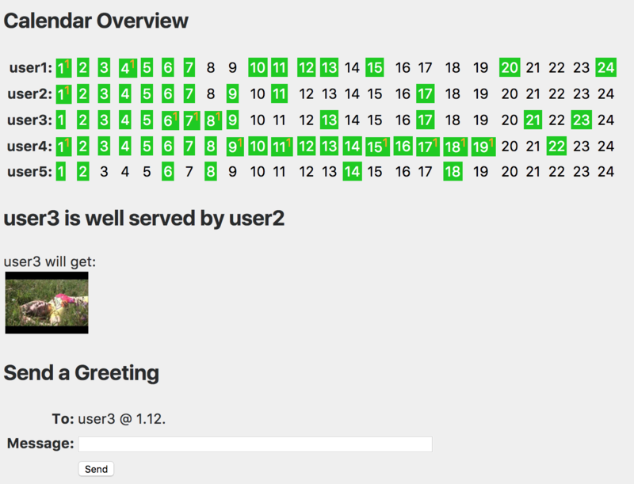

# Advent Calendar

Last years [christmas calendar](https://www.xarg.org/2016/11/creating-an-advent-calendar-with-html5-and-css3/) (where you can see a live demo of the animation still used) was brought to a new level so that a whole clique can participate on filling the little doors. It now has a MySQL backend and a small admin area. Additionally, people can send greetings to eachother that are visualized by gift boxes randomly on the screen.

The calendar can be filled with images and links.

## Admin Area

In the admin area users can fill doors of other users. If the day of certain user is filled already, it's colored green and can only receive additional messages. If a user does not have something in a door for the upcoming day, it's colored red.
The orange small number is the number of messages (=boxes on the screen) a user gets on that day already.

## Installation

All requests that are not files are routed to the index.php file, using nginx's try_files. That way the calendar can be accessed with http://localhost/user1. In the index.php file this is determined on line 15, that the user is fetched from the requested URI.

Additionally three images must be placed in the /image folder: bg.jpg, the background of the site, cal.jpg, the default background of the calendar and box.png, a gift box, which is placed randomly on the screen if users send messages to eachother. Make sure the /image folder has write permissions to make uploads via the admin panel possible.

The MySQL database can be set up easily with the setup.sql file.

That's all. Happy Advent
